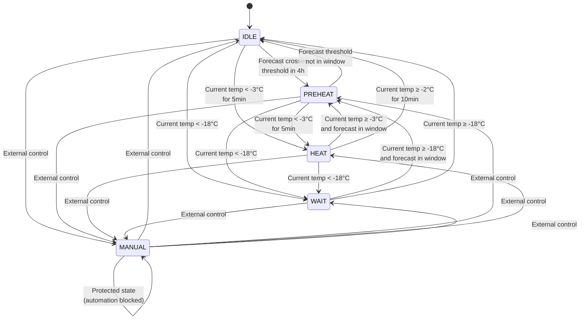
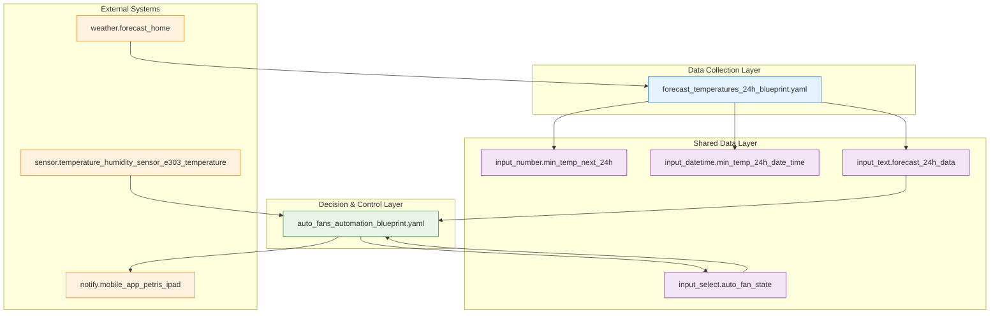

# AI Generated readme based on code 

## 24h Forecast Parser
Create: 
- input_number.min_temp_next_24h - to hold the lowest temp value
- input_datetime.min_temp_24h_date_time - the datetime of the lowest value
- input_text.forecast_24h_data - stores complete 24h forecast as JSON

## Auto Fan State Machine

Create: 
- input_select.auto_fan_state with options: IDLE, PREHEAT, HEAT, WAIT, MANUAL

## State Machine Logic
- **IDLE** = fans off, normal operation
- **PREHEAT** = fans on, preparing for cold weather
- **HEAT** = fans on, actively heating based on current temperature
- **WAIT** = fans off, waiting for conditions (too cold to heat effectively)
- **MANUAL** = controlled by other factors, automation won't modify

## Preheating Logic
The automation now uses threshold crossing detection:
1. Scans 24h forecast to find when temperature first drops below the threshold (-3°C)
2. Starts preheating 4 hours before that threshold crossing
3. More precise than previous minimum temperature approach
4. Single source of truth for threshold values in the auto fan automation

## Required Entities
- External temperature sensor (default: sensor.temperature_humidity_sensor_e303_temperature)
- Weather entity for forecast data (default: weather.forecast_home)
- Notification target (default: notify.mobile_app_petris_ipad)

## State Machine Diagram

## Blueprint Architecture

### Architecture Layers

| Layer | Responsibility | Components |
|-------|----------------|------------|
| **Data Collection** | Fetches and processes forecast data | `forecast_temperatures_24h_blueprint.yaml` |
| **Shared Data** | Stores state and forecast information | Input helpers (JSON, numbers, datetime, select) |
| **Decision & Control** | Analyzes data and controls fan state | `auto_fans_automation_blueprint.yaml` |
| **External Systems** | Provides weather data and receives notifications | Weather entity, temperature sensor, notification service |

### Key Design Principles

1. **Separation of Concerns** - Data collection separated from decision logic
2. **Loose Coupling** - Blueprints communicate only through shared helpers
3. **Single Source of Truth** - JSON forecast data eliminates synchronization issues
4. **Layered Architecture** - Clear data flow from external systems through processing to control

