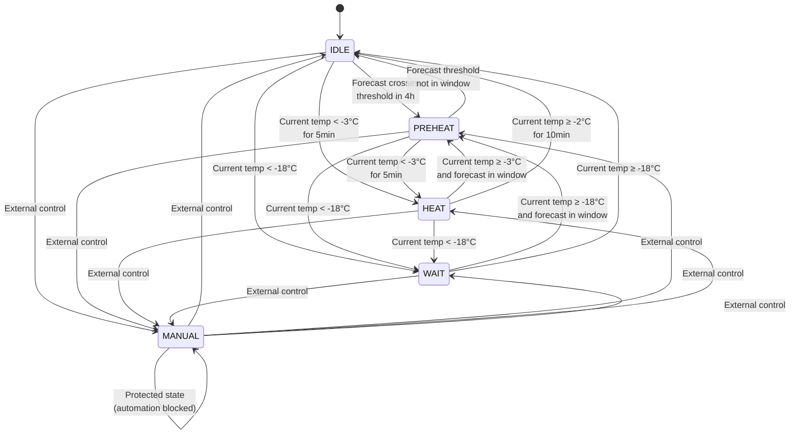
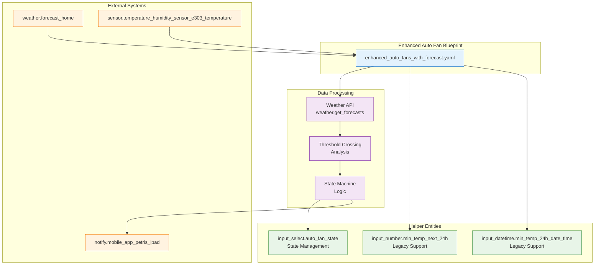

# AI Generated README - Enhanced Auto Fan System

## Unified Blueprint (Recommended)
**File: `enhanced_auto_fans_with_forecast.yaml`**

Create: 
- input_select.auto_fan_state with options: IDLE, PREHEAT, HEAT, WAIT, MANUAL
- input_number.min_temp_next_24h - to hold lowest temp value (updated for backward compatibility)
- input_datetime.min_temp_24h_date_time - datetime of the lowest value (updated for backward compatibility)

### Benefits of Unified Approach
- **Single automation** - combines forecast fetching and state machine logic
- **No storage limitations** - uses variables instead of input_text helpers
- **Enhanced preheating** - threshold crossing detection for more precise control
- **Backward compatibility** - still updates existing helper entities
- **Simplified debugging** - single trace for all operations

## Legacy Blueprints (Deprecated)
The following blueprints are still available but deprecated in favor of the unified approach:
- `forecast_temperatures_24h_blueprint.yaml` - Data collection only
- `auto_fans_automation_blueprint.yaml` - Decision logic only

## State Machine Logic
- **IDLE** = fans off, normal operation
- **PREHEAT** = fans on, preparing for cold weather
- **HEAT** = fans on, actively heating based on current temperature
- **WAIT** = fans off, waiting for conditions (too cold to heat effectively)
- **MANUAL** = controlled by other factors, automation won't modify

## Preheating Logic
The automation now uses threshold crossing detection:
1. Scans 24h forecast to find when temperature first drops below the threshold (-3°C)
2. Starts preheating 4 hours before that threshold crossing
3. More precise than previous minimum temperature approach
4. Single source of truth for threshold values in the auto fan automation

## Required Entities
- External temperature sensor (default: sensor.temperature_humidity_sensor_e303_temperature)
- Weather entity for forecast data (default: weather.forecast_home)
- Notification target (default: notify.mobile_app_petris_ipad)

## State Machine Diagram

## Unified Blueprint Architecture

### Architecture Benefits

| Aspect | Legacy (Split) | Unified |
|--------|----------------|---------|
| **Complexity** | High (2 blueprints) | Low (1 blueprint) |
| **Data Storage** | Limited by input_text | Unlimited (variables) |
| **Debugging** | Hard (trace across 2) | Easy (single trace) |
| **Performance** | Multiple helper ops | Single execution |
| **Maintenance** | Sync issues | Single codebase |
| **Preheating** | Basic min temp logic | Enhanced threshold crossing |

### Key Design Principles

1. **Unified Processing** - All logic in single automation
2. **Variable Storage** - No helper storage limitations
3. **Backward Compatibility** - Maintains existing helper updates
4. **Enhanced Logic** - Threshold crossing for precise preheating
5. **Simplified Architecture** - Clear single responsibility

